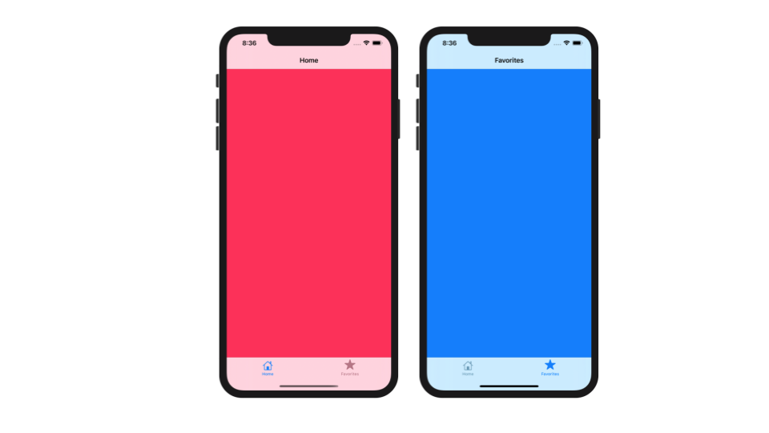

Tab bar controllers are common to be found on mobile applications considering the convenience they offer in terms of switching between screens. Here, I am going to show you how to create a tab bar controller programmatically in Swift (without using Storyboard).

The main thing that we need to understand is that this **tab bar controller** holds other **navigation controllers**, that also become the container for other **view controllers**. Thus, creating the view controllers the navigation controllers contain is a good point to begin with.

I create two separate files for each view controllers, I name them HomeVC and FavoritesVC. The view controllers simply show plain background color.

**HomeVC.swift**

```swift
    import UIKit
    
    class HomeVC: UIViewController {
    
        override func viewDidLoad() {
            super.viewDidLoad()
            
            view.backgroundColor = .systemPink
        }
    }
```

**FavoritesVC.swift**

```swift
    import UIKit
        
    class FavoritesVC: UIViewController {
    
        override func viewDidLoad() {
            super.viewDidLoad()
    
            view.backgroundColor = .systemBlue
        }
    }
```

Then, in SceneDelegate.swift, we create three functions as follows. The goal of this block of code is to create one tab bar controller and two navigation controllers. As I stated earlier, the first one will 'hold' the other two.

```swift
    func createTabBar() -> UITabBarController {
            
        let tabBar = UITabBarController()
        let homeNC = createHomeNavigationController()
        let favoritesNC = createFavoritesNavigationController()
        
        tabBar.viewControllers = [homeNC, favoritesNC]
        
        return tabBar
            
    }
        
    func createHomeNavigationController() -> UINavigationController {
            
        let homeVC = HomeVC()
        homeVC.title = "Home"
        homeVC.tabBarItem = UITabBarItem(title: "Home", image: UIImage(systemName: "house"), tag: 0)
        
        return UINavigationController(rootViewController: homeVC)
    }
        
     func createFavoritesNavigationController() -> UINavigationController {
            
        let favoritesVC = FavoritesVC()
        favoritesVC.title = "Favorites"
        favoritesVC.tabBarItem = UITabBarItem(tabBarSystemItem: .favorites, tag: 1)
        
        return UINavigationController(rootViewController: favoritesVC)   
    }
```

Making separate functions with specific functionality like above is my personal preference. If you find it not too efficient, then you can write the code with the style you are happy with.

Next, inside the uppermost boilerplate function, still, in SceneDelegate.swift file, we add the following lines of code:

```swift
    func scene(_ scene: UIScene, willConnectTo session: UISceneSession, options connectionOptions: UIScene.ConnectionOptions) {
            
        guard let windowScene = (scene as? UIWindowScene) else { return }
        
        window = UIWindow(frame: windowScene.coordinateSpace.bounds)
        window?.windowScene = windowScene
        window?.makeKeyAndVisible()
        
        let tabBar = createTabBar()
        window?.rootViewController = tabBar
    }
```

Line 5 to 7 is the setup we need to set considering that we are not using Storyboard. Finally, we set the instance of our tab bar controller to the rootViewController of the window. The final result will pretty much look like this.



That's it. Thank you.

***

###### *Thumbnail Photo by [Jakob Owens](https://unsplash.com/@jakobowens1?utm_source=unsplash&utm_medium=referral&utm_content=creditCopyText) on [Unsplash](https://unsplash.com/s/photos/app-iphone?utm_source=unsplash&utm_medium=referral&utm_content=creditCopyText)

